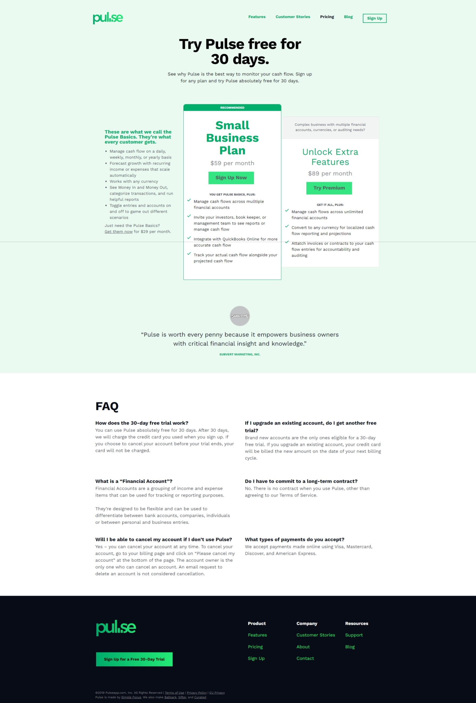

# Pulse pricing page - mock project

This is a mock project for my Full stack web development course at AlmaBetter. This project only contains the UI part of that particular page. This project is not fully responsive since it was not asked for. It will work fine for 1280px screens and larger. 

While doing this project I have learned about some of button animations. Those were quite interesting for me. Technologies used in this project are:

- HTML
- CSS
- Tailwind CSS

You can see the result using the following link or you can run this project in your local system by following some steps.

### Live link: https://pulse-pricing-mock-project-souvik-nath.vercel.app/

### Steps to run in your system:

- Download zip file of this repository
- Unzip the file using any extraction tool like WinRAR
- Go to src
- Run index.html

>This is how it looks like in large screens

